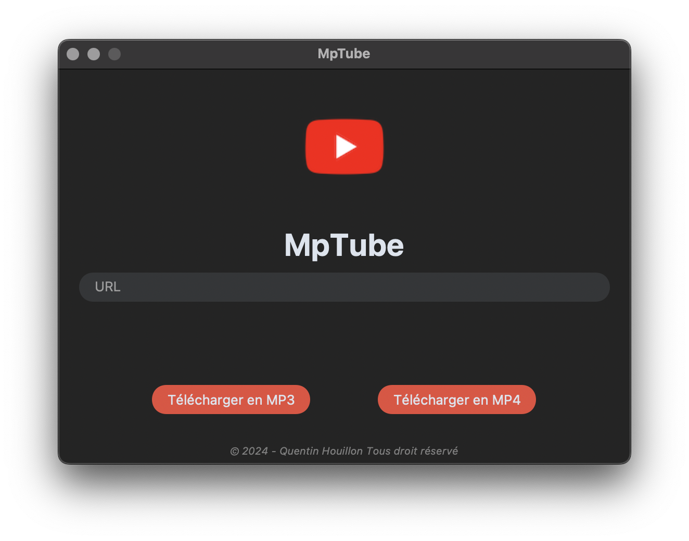

## Description
MpTube est un outil permettant de télécharger simplement des vidéos youtube en mp3 et mp4.

---

## Développement
- Python 3.11
- Tkinter (GUI)

## Plateforme
- MacOS
- Linux
- Windows

## License
- Tous droits réservés

## Auteur
- Quentin HOUILLON
- [GitHub](https://github.com/quentinhouillon/)